# Client Demo, License, Upgrade, and Enterprise Operations Runbook

**Audience:** client platform administrators, client developers, QA engineers, release managers, security reviewers, Horizon Relevance sales engineers, and Horizon Relevance license operators.  
**Product model:** client-hosted Horizon Relevance AI DevSecOps platform.  
**Evidence baseline:** May 2026 internal enterprise simulation.

## Table of Contents

1. [Purpose](#1-purpose)
2. [What The Client Owns And What Horizon Owns](#2-what-the-client-owns-and-what-horizon-owns)
3. [Current Capability Status](#3-current-capability-status)
4. [Enterprise Architecture Summary](#4-enterprise-architecture-summary)
5. [License Lifecycle](#5-license-lifecycle)
6. [Trial, Expiration, Renewal, And Upgrade](#6-trial-expiration-renewal-and-upgrade)
7. [Payment And Commercial Upgrade Model](#7-payment-and-commercial-upgrade-model)
8. [How Horizon Generates And Delivers Activation Tokens](#8-how-horizon-generates-and-delivers-activation-tokens)
9. [How Horizon Maintains Client History](#9-how-horizon-maintains-client-history)
10. [Client Demo From Scratch](#10-client-demo-from-scratch)
11. [UI Screenshots And Evidence](#11-ui-screenshots-and-evidence)
12. [Validation Checklist](#12-validation-checklist)
13. [Operational Troubleshooting](#13-operational-troubleshooting)
14. [What Is Ready And What Still Needs Hardening](#14-what-is-ready-and-what-still-needs-hardening)

## 1. Purpose

This document explains how a client uses the Horizon Relevance platform as an enterprise client-hosted product, from initial trial onboarding through build, validation, release promotion, license renewal, and commercial upgrade.

It also explains how Horizon Relevance operates the licensing side of the platform:

- creating client records
- issuing trial or enterprise activation tokens
- signing license entitlements
- tracking installations and usage
- handling renewals and upgrades
- maintaining audit history
- supporting expired or suspended clients

The goal is to provide one practical runbook that can be used for a client demo, a 14/30-day POC, or an internal enterprise simulation.

## 2. What The Client Owns And What Horizon Owns

| Area | Owner | Notes |
| --- | --- | --- |
| AWS account | Client | Client keeps source, artifacts, app images, secrets, logs, and deployment evidence inside its own AWS boundary. |
| DNS/domain | Client | Client may use its own domain, Route 53 zone, ACM certificates, or corporate DNS process. |
| Source repositories | Client | Horizon does not need source-code ownership. Jenkins checks out code using client-approved credentials. |
| Application ECR | Client | Application images are built and pushed into client ECR. |
| Artifact S3 bucket | Client | `image.json`, `templateconfiguration.json`, reports, and release evidence are stored in client S3. |
| EKS clusters/namespaces | Client | DEV, QA, STAGE, and PROD can be separate clusters or namespace-scoped environments. |
| IAM roles | Client | Enterprise model prefers validation-only IAM: client creates roles, installer validates them. |
| Product images | Horizon | Horizon publishes frontend, backend, Jenkins, scanner, SonarQube, and license service images in private ECR. |
| License service | Horizon | Horizon owns the commercial source of truth and signs entitlements. |
| License activation token | Horizon issues, client installs | Token is stored as a Kubernetes secret, not committed to Git. |
| Environment Catalog | Client admin configures | Developers select only an environment name; AWS internals are resolved server-side. |

## 3. Current Capability Status

| Area | Status | Notes |
| --- | --- | --- |
| License Service MVP | Completed | FastAPI service, PostgreSQL schema, admin APIs, activation tokens, signed license generation, audit events, Dockerfile, and Helm chart exist. |
| Client Platform Integration | Completed | Backend license status/sync, cache, scheduled sync, frontend License page, and license enforcement are deployed. |
| KMS/Public-Key License Signing | Mostly completed | AWS KMS asymmetric signing and public-key verification are active in the enterprise model. |
| License Revocation/Suspension | Completed at API level | Admin APIs support revoking/suspending clients, installations, licenses, and activation tokens. |
| Activation Token Rotation | Partially completed | Patch/revoke APIs exist. Full operator UI workflow is still basic. |
| Commercial Operations | Partially completed | Upgrade request flow and docs exist. Invoice/private offer process is documented, not fully automated. |
| Usage Metering | Partially completed | Usage reporting hooks exist. Full usage dashboard and strict limit enforcement are future work. |
| Enterprise Installer | Mostly completed | Terraform/Helm installer, validation-only IAM, namespace-scoped mode, catalog sync, destroy workflow, S3 backend model, and docs are in place. |
| Environment Catalog | Completed for current model | Backend stores/serves environment catalog. UI resolves environment details instead of asking developers for AWS internals. |
| Generic RBAC/LDAP Mapping | Mostly completed | Generic role mappings are supported. Team/app ownership model still needs polish. |
| Private ECR Product Distribution | Partially completed | Horizon ECR images are used. Per-client pull governance, Cosign signing, SBOM, and provenance are still pending. |
| Horizon License Portal | MVP only | Admin APIs and basic portal exist. Production SSO/MFA/RBAC portal is not complete. |
| Billing Automation | Not completed | AWS Marketplace private offer automation, Stripe/Paddle, invoice webhooks, and payment-driven renewal are future work. |
| Production Control Plane Hardening | Partially completed | KMS signing and hashed activation tokens are done. RDS, WAF, CloudWatch alarms, backups, and rotation still need productionization. |
| Observability/Supportability | Partially completed | Health checks and docs exist. Support bundle export, version matrix, upgrade history, and support dashboard are future work. |
| Compliance/Audit Package | Partially completed | Audit events exist. SOC2 mapping, retention policy, pen-test checklist, and formal compliance package are future work. |
| Trial/Customer Success Experience | Partially completed | Trial license model and sync exist. Trial dashboard and sales handoff workflow need polish. |

## 4. Enterprise Architecture Summary

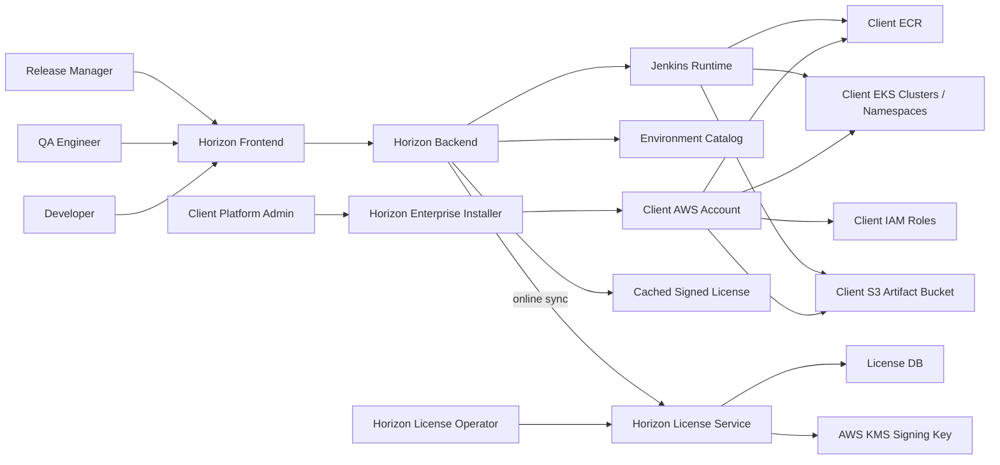

Key principle: the client runs the product in the client AWS account, while Horizon only receives license sync metadata. Horizon does not receive client source code, built application images, S3 artifacts, secrets, or runtime logs unless the client explicitly shares a support bundle.

## 5. License Lifecycle

The license model is online-sync by default.

1. Horizon creates a client record in the Horizon license service.
2. Horizon creates a subscription: trial, paid, or enterprise.
3. Horizon generates an activation token.
4. Client stores that token as a Kubernetes secret in the platform namespace.
5. Client backend calls Horizon license service `/api/v1/licenses/sync`.
6. Horizon validates the activation token, client, AWS account, installation ID, subscription, and expiration.
7. Horizon returns a signed license entitlement.
8. Client backend verifies the signature with Horizon public key set.
9. Backend caches the signed license and enforces it before creating Jenkins jobs.
10. Jenkins validates the same entitlement before executing pipeline logic.

The client values file should not contain a handwritten license payload. It should reference the activation token secret and license sync endpoint.

Example contract:

```yaml
license:
  mode: online-sync
  syncEndpoint: https://license.horizonrelevance.com/api/v1/licenses/sync
  activationTokenSecretName: horizon-license-activation
```

## 6. Trial, Expiration, Renewal, And Upgrade

### Trial Start

For a trial, Horizon creates:

- client record
- trial plan or subscription
- activation token
- allowed AWS account IDs
- enabled pipelines
- allowed environments
- expiration date
- usage limits

The client installs the product, creates the activation-token secret, and clicks **Sync License** from the License page. The backend receives a signed trial license.

### Trial Expiration

When a trial expires:

- backend license status becomes expired or grace-period eligible
- pipeline creation is blocked after grace period
- Jenkins also blocks pipeline execution
- License page shows the current license state
- client can request an upgrade or extension

### Renewal

If Horizon extends or renews the subscription, the client does not edit `values.yaml`. The client either:

- clicks **Sync License** in the UI, or
- waits for scheduled backend sync.

The backend receives the updated signed license and caches it.

### Upgrade To Paid Or Enterprise

The client submits an upgrade request from the License page or through Horizon sales/customer success. Horizon reviews the request, completes payment/contract workflow, updates the subscription, and the client syncs the license.

## 7. Payment And Commercial Upgrade Model

The recommended commercial path is manual-first, automation-second.

### Trial To Paid Workflow

1. Client runs 14/30-day trial.
2. Client validates success criteria.
3. Client requests upgrade.
4. Horizon sales prepares one of:
   - manual invoice
   - annual order form
   - AWS Marketplace private offer
   - later, Stripe/Paddle for SMB self-service
5. Client accepts/pays.
6. Horizon license operator activates paid or enterprise subscription.
7. Client clicks **Sync License**.
8. Platform unlocks paid/enterprise entitlements.

### Payment Methods

| Payment Method | Best For | Current Status |
| --- | --- | --- |
| Manual invoice/order form | Enterprise and regulated clients | Documented and ready for early sales motion. |
| AWS Marketplace private offer | Enterprise cloud procurement | Recommended next commercial workflow. Not fully automated. |
| Stripe/Paddle | SMB/self-service | Future option. Not required for first enterprise pilots. |
| Purchase order | Healthcare, pharma, telecom, fintech | Supported as manual business workflow. |

### How Payment Updates License

Payment itself does not directly update the client backend. Horizon updates the subscription in the Horizon license service after payment or contract acceptance. The client backend then receives the renewed or upgraded entitlement during license sync.

## 8. How Horizon Generates And Delivers Activation Tokens

Horizon generates activation tokens from the license service. Tokens are never stored in plaintext; they are hashed with a server-side pepper.

Recommended operator flow:

1. Horizon license operator creates client.
2. Horizon creates subscription.
3. Horizon creates activation token for that subscription.
4. Horizon sends activation token to the client's platform admin through a secure channel.
5. Client creates Kubernetes secret:

```bash
kubectl create secret generic horizon-license-activation \
  -n <client-platform-namespace> \
  --from-literal=ENTERPRISE_LICENSE_ACTIVATION_TOKEN='<activation-token>'
```

6. Client installs or upgrades backend Helm values referencing the secret.
7. Client opens License page and clicks **Sync License**.

Do not send activation tokens through public tickets, Git commits, screenshots, or shared docs.

## 9. How Horizon Maintains Client History

Horizon license service maintains the commercial and operational history for every client.

| Record Type | Purpose |
| --- | --- |
| Client | Legal/customer identity, status, and account metadata. |
| Plan | Trial, paid, or enterprise bundle definitions. |
| Subscription | Active contract, enabled features, allowed environments, limits, and expiration. |
| Installation | Client-hosted runtime instance bound to installation ID and AWS account. |
| Activation token | Secure bootstrap token for online license sync. |
| License | Signed entitlement issued to the client backend. |
| Usage event | Builds, scans, deployments, users, repositories, and environment usage. |
| Upgrade request | Client request for more usage, paid upgrade, production access, or support. |
| Commercial offer | Invoice/private offer/contract metadata and activation state. |
| Audit event | Who changed what, when, and why. |

The Horizon internal dashboard/portal should let operators answer:

- Which clients are active, trialing, expired, suspended, or enterprise?
- Which installations have synced recently?
- Which AWS account IDs are bound to a client?
- Which pipelines/environments are licensed?
- Which clients are near usage limits?
- Which trials expire soon?
- Which upgrade requests are pending?
- Which license tokens were revoked or rotated?
- Which audit events occurred for a client?

Current state: the admin APIs and basic portal exist. Production-grade SSO/MFA/RBAC for Horizon operators is still a hardening item.

## 10. Client Demo From Scratch

Use this sequence for a realistic end-client demo.

### Step 1: Client Installs Or Uses Horizon In Client AWS Account

Client platform admin prepares:

- AWS account IDs
- DNS/base domain
- artifact S3 bucket
- application ECR repository
- EKS clusters or namespaces
- IAM deploy roles
- LDAP/Keycloak or existing IdP mapping
- activation token secret

Run installer phases:

```bash
bash secure_SDLC_Platform/scripts/preflight.sh \
  -f secure_SDLC_Platform/examples/<client-values>.yaml \
  --environment DEV \
  --dry-run
```

```bash
bash secure_SDLC_Platform/scripts/install.sh \
  --phase infra \
  --environment DEV \
  -f secure_SDLC_Platform/examples/<client-values>.yaml \
  --auto-approve
```

```bash
bash secure_SDLC_Platform/scripts/install.sh \
  --phase platform \
  -f secure_SDLC_Platform/examples/<client-values>.yaml
```

```bash
bash secure_SDLC_Platform/scripts/install.sh \
  --phase catalog \
  --environment DEV \
  -f secure_SDLC_Platform/examples/<client-values>.yaml
```

Repeat catalog sync for QA, STAGE, and PROD after those environments are provisioned or validated.

### Step 2: Admin Syncs License

Client admin opens the Horizon UI and goes to **License**.

Expected result:

- license mode is online sync
- license type is trial, paid, or enterprise
- expiration is visible
- enabled pipelines are visible
- enabled environments are visible
- Sync License action succeeds

If the license expired but Horizon renewed the subscription, click **Sync License** again. The backend receives a new signed entitlement.

### Step 3: Admin Configures Environment Catalog

Client platform admin opens **Environment Catalog** and saves entries for DEV, QA, STAGE, and PROD.

Developers should not enter AWS account IDs, role ARNs, EKS cluster names, artifact buckets, or namespace internals during pipeline creation. They should select only the target environment.

Required fields per environment:

| Field | Purpose |
| --- | --- |
| Environment name | `DEV`, `QA`, `STAGE`, or `PROD`. |
| AWS account ID | Account that owns ECR/S3/EKS for that environment. |
| AWS region | Region for ECR/S3/EKS. |
| ECR registry/account ID | Registry where app images are stored/promoted. |
| ECR repository template | Application image repository naming rule. |
| Artifact bucket | S3 bucket for metadata, reports, and evidence. |
| EKS cluster name | Target cluster for deployment. |
| Deployment role ARN | Role Jenkins/backend assumes for deployment. |
| Namespace strategy/template | Namespace isolation model for teams/apps. |

### Step 4: Developer Runs Build & Deploy To DEV

Developer opens **Build & Deploy Pipeline** and enters:

- project name
- project type
- repository type
- repository URL
- branch
- target environment `DEV`
- notification recipients

The backend resolves environment details from the Environment Catalog.

The Jenkins job:

1. checks out source
2. builds application
3. builds Docker image
4. pushes image to client ECR
5. writes `image.json`
6. writes `templateconfiguration.json`
7. deploys to DEV EKS namespace

### Step 5: Validate DEV

Developer or QA opens **Validation Pipeline** and points it to the deployed DEV app.

Typical checks:

- UI end-to-end test
- API regression test
- performance test
- code quality scan
- static security scan
- container/IaC vulnerability scan
- policy validation

### Step 6: Release Manager Promotes Same Digest To QA

Release manager opens **Release Promotion Pipeline**.

Important: QA should not rebuild source. QA should receive the same immutable image digest built in DEV.

Use:

```text
Artifact Prefix / Build ID: devops-pipeline/<project-name>/<build-tag>
Source Environment: DEV
Target Environment: QA
Source Image Tag: <build-tag>
Target Release Tag(s): qa-<build-tag>
```

The release job reads the original metadata from S3, promotes/tags the image, deploys to QA, and writes `approval.json` and `deployment.json` under the QA evidence folder.

### Step 7: QA Runs Validation Pipeline

QA validates the QA deployment using the QA app URL, image URI, and selected validation gates.

Expected result:

- QA validation passes
- findings dashboard receives normalized findings
- reports are stored in S3/Jenkins artifacts
- QA deployment evidence is available

### Step 8: Release Manager Promotes QA To STAGE

Use the same base artifact prefix and source image tag:

```text
Artifact Prefix / Build ID: devops-pipeline/<project-name>/<build-tag>
Source Environment: QA
Target Environment: STAGE
Source Image Tag: <build-tag>
Target Release Tag(s): stage-<build-tag>
```

### Step 9: Release Manager Promotes STAGE To PROD

For production, use approval and production tag conventions:

```text
Source Environment: STAGE
Target Environment: PROD
Target Release Tag(s): prod-<build-tag>
```

The same digest that passed QA and STAGE should be deployed to PROD.

## 11. UI Screenshots And Evidence

### Build & Deploy Pipeline

The developer selects the application source, project type, repository, branch, and target environment. Infrastructure details are resolved from the Environment Catalog.

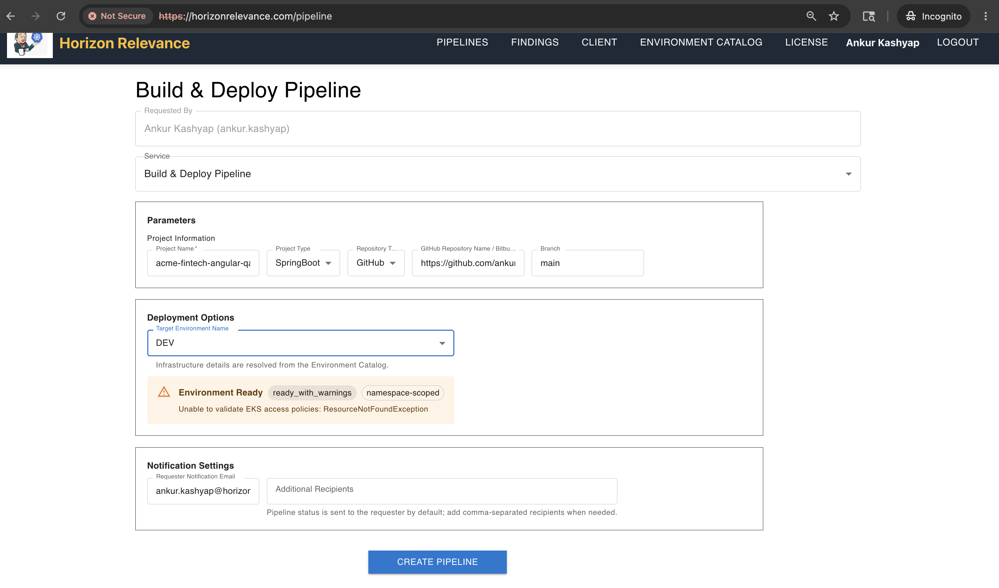

### Validation Pipeline

QA selects validation gates such as UI, API, performance, code quality, static security, container/IaC vulnerability, and policy validation.

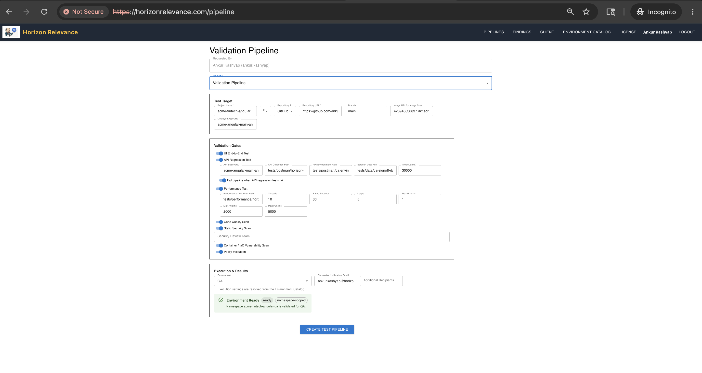

### Release Promotion Pipeline

Release managers promote the same immutable image digest from QA to STAGE or STAGE to PROD.

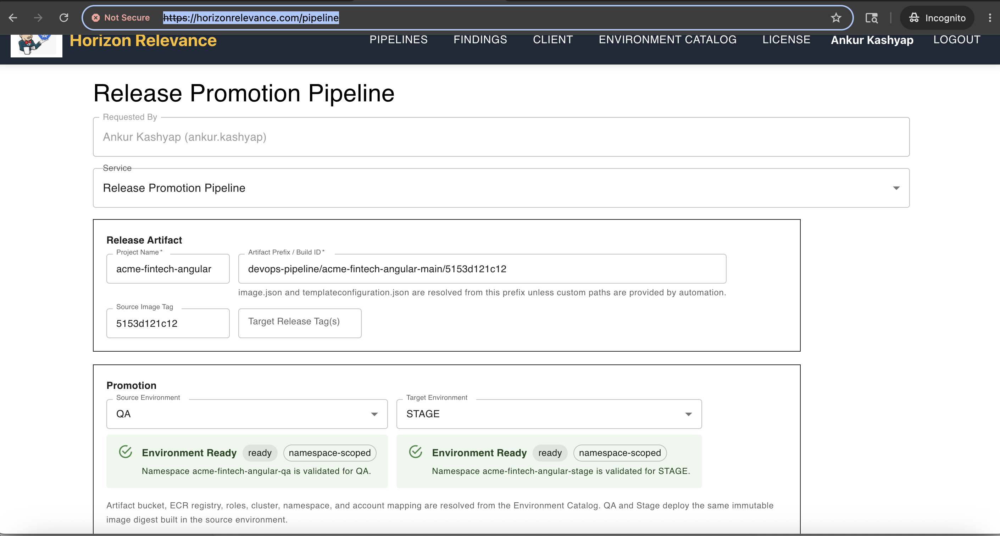

### S3 Artifact Evidence

The platform writes release metadata and evidence to the client-owned artifact bucket.

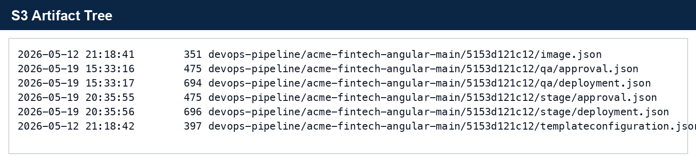

### image.json

`image.json` identifies the image URI, immutable digest, repository, and build tag produced by the build pipeline.

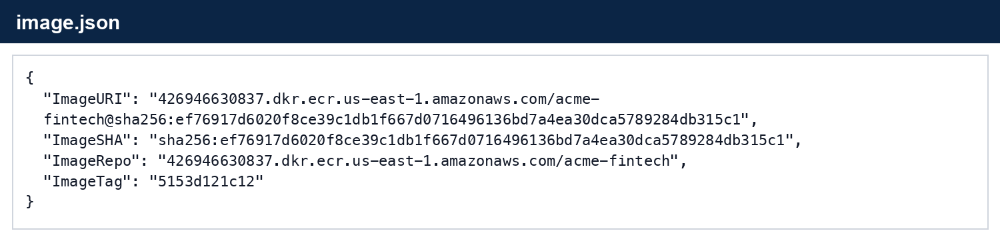

### templateconfiguration.json

`templateconfiguration.json` carries deployment parameters and image metadata for downstream promotion/deployment stages.

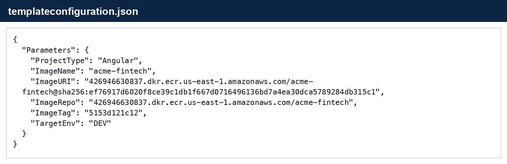

### ECR Image Evidence

The application image lives in client-owned ECR with commit-based and release tags.

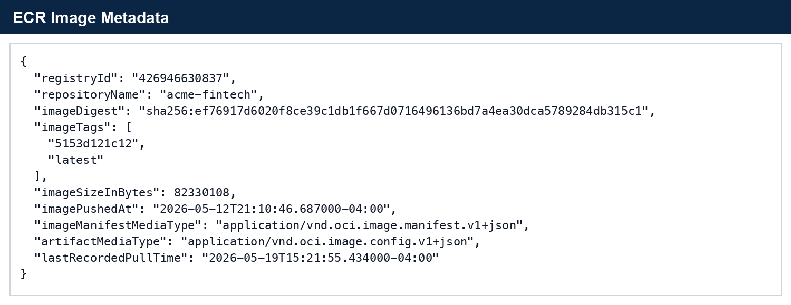

### Jenkins Evidence

Jenkins provides traceability for build, QA promotion, and STAGE promotion.

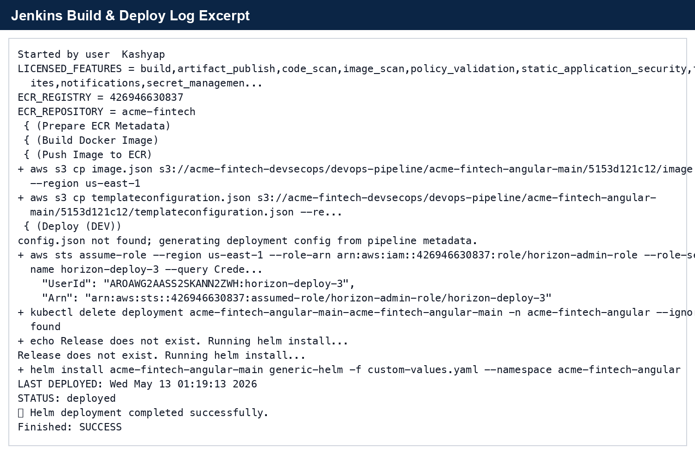

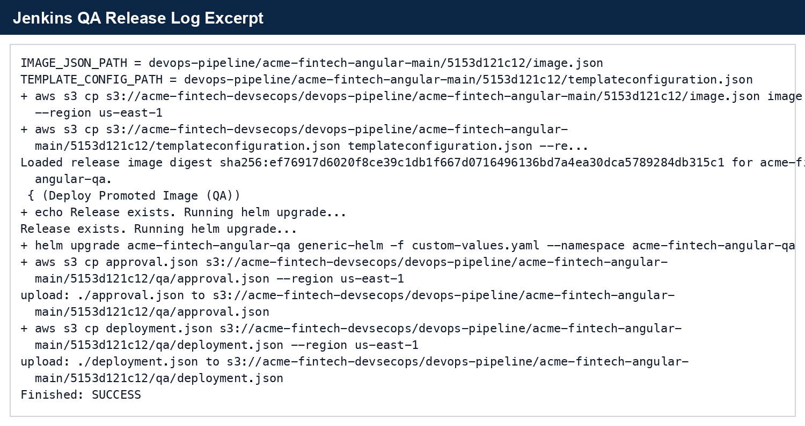

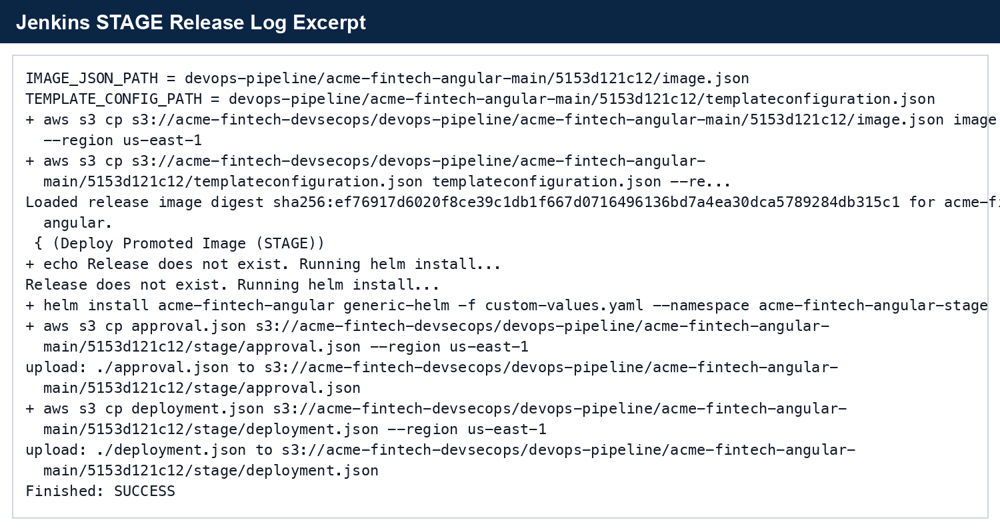

### Kubernetes Runtime Evidence

The final result is a running application workload in the target namespace.

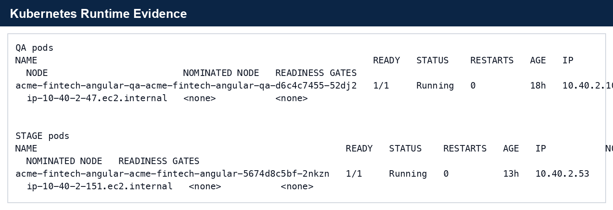

## 12. Validation Checklist

| Step | Expected Result |
| --- | --- |
| License sync | License page shows active trial, paid, or enterprise entitlement. |
| Environment Catalog | Target environment shows ready or ready with acceptable warnings. |
| Build & Deploy | Jenkins job succeeds and app image is pushed to ECR. |
| S3 metadata | `image.json` and `templateconfiguration.json` exist under the base prefix. |
| DEV deployment | App pod runs in DEV namespace. |
| DEV validation | Selected validation gates complete and publish results. |
| QA promotion | Same image digest is deployed to QA. |
| QA validation | QA tests and security scans publish results. |
| STAGE promotion | Same image digest is deployed to STAGE. |
| Findings dashboard | Vulnerabilities/security findings are normalized by category and severity. |
| License enforcement | Unlicensed pipelines/environments are blocked before Jenkins execution. |
| Audit evidence | License sync, pipeline execution, promotion, and usage events are traceable. |

## 13. Operational Troubleshooting

| Issue | Likely Cause | Fix |
| --- | --- | --- |
| License sync fails | Expired token, wrong client ID, wrong AWS account, blocked outbound HTTPS, or subscription suspended. | Validate activation token secret, license endpoint, and Horizon subscription status. |
| License expired after payment | Horizon subscription was not activated or client has not synced. | Horizon activates subscription, client clicks Sync License or waits for scheduled sync. |
| Pipeline is blocked | License does not include selected pipeline/environment/feature. | Upgrade entitlement or select an allowed environment. |
| Developer sees AWS fields | Environment Catalog was not synced or frontend/backend is old. | Run installer catalog phase and deploy current frontend/backend. |
| EKS validation warning | Deploy role has broad cluster access or cannot validate namespace-scoped policy. | Fix EKS access entry/RBAC and rerun preflight. |
| Release promotion cannot find metadata | Artifact prefix points to `/qa` or `/stage` evidence folder instead of base prefix. | Use base prefix: `devops-pipeline/<project>/<build-tag>`. |
| QA rebuilds image | Build & Deploy was used instead of Release Promotion. | Promote existing digest through Release Promotion Pipeline. |
| Findings dashboard missing categories | Scanner artifacts were generated but not normalized/published. | Validate Jenkins publishing step and backend findings ingestion. |

## 14. What Is Ready And What Still Needs Hardening

### Ready For Client Demo And Assisted POC

- client-hosted architecture story
- online license sync
- KMS/public-key signed entitlement
- build/deploy pipeline
- validation pipeline
- release promotion pipeline
- Environment Catalog
- Jenkins traceability
- S3/ECR evidence
- findings dashboard flow
- installer lifecycle

### Not Yet Fully Self-Service Enterprise Production

- production Horizon internal license portal with SSO/MFA/RBAC
- automated AWS Marketplace/private-offer billing workflow
- full usage dashboard and hard usage-limit enforcement
- Cosign image signing, SBOM, and provenance
- per-client private ECR governance automation
- support bundle export
- SOC2-ready control mapping and retention policy
- automated backup/restore and upgrade history

The platform is ready for a controlled client demo or Horizon-assisted trial. For unattended regulated production, complete the remaining hardening items before calling it fully self-service enterprise-ready.

