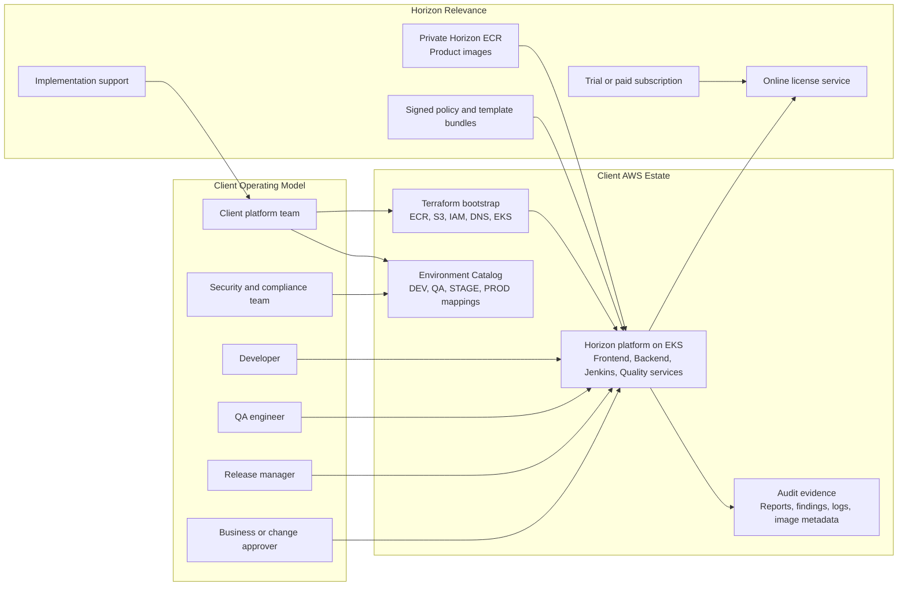
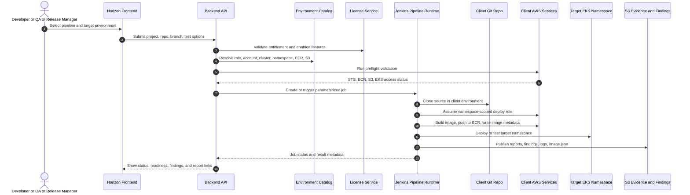
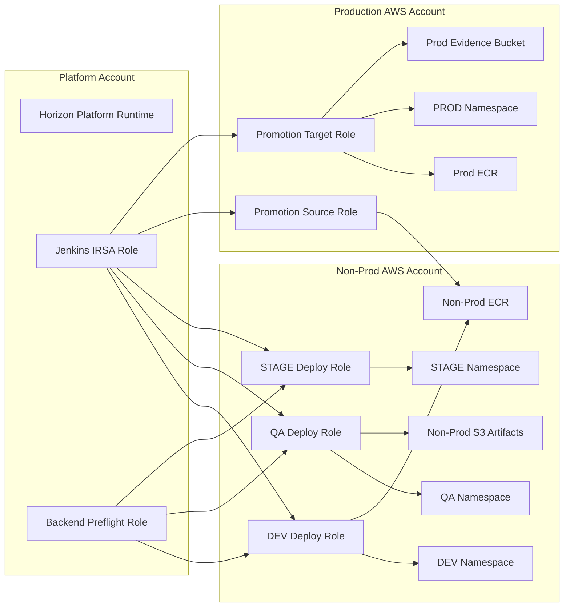
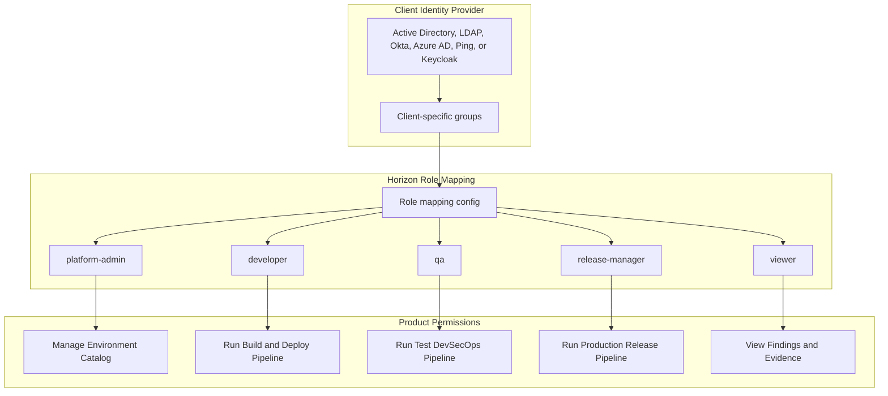
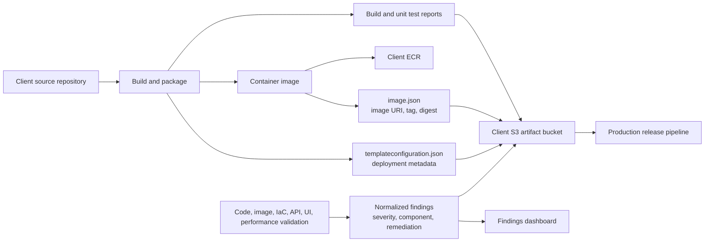
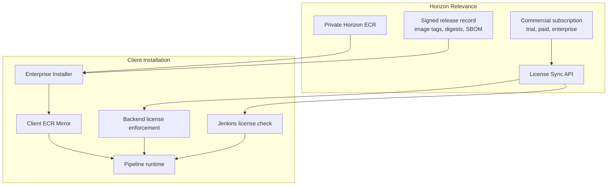
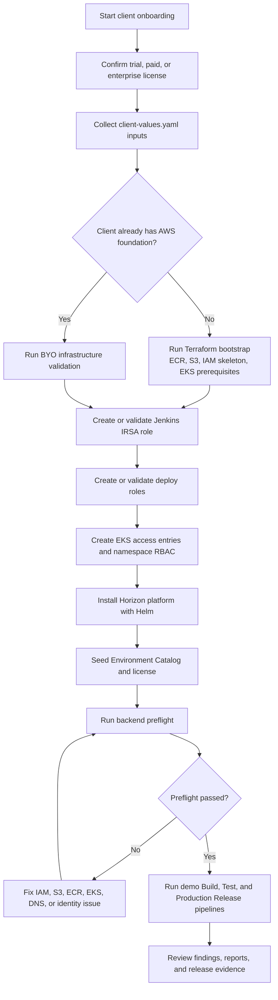

# Client Enterprise Architecture

## Table of Contents

1. [Purpose](#purpose)
2. [Architecture Principles](#architecture-principles)
3. [Techno-Functional View](#techno-functional-view)
4. [Client-Hosted AWS Architecture](#client-hosted-aws-architecture)
5. [AWS Services and Platform Components](#aws-services-and-platform-components)
6. [Pipeline Process Model](#pipeline-process-model)
7. [Environment and Account Segregation](#environment-and-account-segregation)
8. [Identity, Roles, and Access Control](#identity-roles-and-access-control)
9. [Data, Artifact, and Evidence Flow](#data-artifact-and-evidence-flow)
10. [License and Image Distribution Model](#license-and-image-distribution-model)
11. [Client Onboarding Flow](#client-onboarding-flow)
12. [Operational Responsibilities](#operational-responsibilities)

## Purpose

This document describes the conceptual enterprise architecture for a client-hosted Horizon Relevance AI DevSecOps deployment.

The target client model is:

- Client source code stays inside the client-approved repositories.
- Client cloud accounts, EKS clusters, IAM roles, ECR repositories, S3 buckets, secrets, DNS, and identity providers remain client-owned.
- Horizon Relevance provides the product images, Helm/Terraform installer, license, pipeline runtime, policy packs, and support.
- Jenkins, backend, frontend, scanners, quality gates, and reporting run inside the client-hosted platform.
- The Horizon license service validates commercial entitlement, but it does not receive client source code, artifacts, container images, secrets, or regulated data.

## Architecture Principles

| Principle | Implementation |
| --- | --- |
| Client-hosted execution | Platform runs inside the client's AWS account/EKS cluster. |
| No source-code exfiltration | Jenkins clones/builds/scans code inside client infrastructure. |
| Environment catalog | Developers select `DEV`, `QA`, `STAGE`, or `PROD`; backend resolves account, role, cluster, namespace, ECR, and S3 details server-side. |
| Validation-only IAM | Enterprise clients create IAM roles; installer/backend validates them instead of silently creating broad roles. |
| IRSA runtime identity | Jenkins uses a Kubernetes service account role, not an EKS node role. |
| Namespace-scoped deployment | Deploy roles are mapped into EKS with access only to the target application namespace. |
| White-labeled security findings | Dashboards show vulnerabilities, malicious patterns, policy violations, and remediation guidance without exposing internal scanner tooling. |
| License-bound runtime | License is bound to client ID, installation ID, enabled features, allowed AWS accounts, and expiration. |

## Techno-Functional View

This view shows how business users, client platform teams, Horizon Relevance, and AWS services interact from onboarding through production promotion.



## Client-Hosted AWS Architecture

This is the core technical architecture. The product control plane runs in the client account, while Horizon Relevance only provides license validation and approved product releases.

```mermaid
flowchart TB
  subgraph Horizon["Horizon Relevance SaaS and Release Plane"]
    LicenseServer["License Server\ntrial, paid, enterprise entitlement"]
    HorizonECR["Private Horizon ECR\nfrontend, backend, Jenkins, scanner images"]
    PolicyBundleStore["Signed Rule and Template Bundles\npolicy packs, pipeline templates"]
  end

  subgraph ClientShared["Client Shared or Platform AWS Account"]
    DNS["Route 53 / Client DNS"]
    ACM["ACM TLS certificates"]
    ALB["AWS Load Balancer Controller\nIngress"]
    Secrets["AWS Secrets Manager\nplatform secrets"]
    PlatformEKS["Platform EKS Cluster"]
    ClientECR["Client ECR Mirror\napproved product images and app images"]
    ArtifactS3["S3 Artifact Bucket\nimage.json, reports, evidence"]
    CloudWatch["CloudWatch Logs and Metrics"]

    subgraph PlatformNS["horizon-platform Namespace"]
      Frontend["Frontend UI\npipeline forms, findings, license, catalog"]
      Backend["Backend API\nlicense, environment catalog, preflight, Jenkins trigger"]
      Jenkins["Jenkins Controller\npipeline execution"]
      Sonar["Code Quality Service"]
      Scanner["Container and IaC Vulnerability Scanner"]
      Policy["Policy Validation Service"]
      TestTools["Test Executors\nUI, API, performance"]
    end
  end

  subgraph ClientIdentity["Client Identity"]
    IdP["Client LDAP, AD, OIDC, or Keycloak"]
    Groups["Client groups mapped to roles\nadmin, developer, QA, release manager, viewer"]
  end

  subgraph ClientSource["Client Engineering Systems"]
    Git["GitHub, GitLab, or Bitbucket"]
    Ticketing["Optional Jira, ServiceNow, GRC"]
    Email["Client Email Gateway\nSMTP, SES, or enterprise mail relay"]
  end

  subgraph NonProd["Client Non-Prod AWS Account"]
    DevEKS["DEV EKS Cluster or Namespace"]
    QaEKS["QA EKS Cluster or Namespace"]
    StageEKS["STAGE EKS Cluster or Namespace"]
    NonProdECR["Non-Prod ECR\napplication images"]
    NonProdS3["Non-Prod S3\nartifacts and reports"]
    NonProdRoles["DEV, QA, STAGE Deploy Roles"]
  end

  subgraph Prod["Client Prod AWS Account"]
    ProdEKS["PROD EKS Cluster or Namespace"]
    ProdECR["Prod ECR\napproved release images"]
    ProdS3["Prod S3\nrelease evidence"]
    ProdRoles["Prod Source and Target Roles"]
  end

  DNS --> ALB
  ACM --> ALB
  ALB --> Frontend
  Frontend --> Backend
  Backend --> Jenkins
  Backend --> Secrets
  Backend --> LicenseServer
  HorizonECR --> ClientECR
  PolicyBundleStore --> PlatformEKS
  ClientECR --> PlatformEKS
  IdP --> Frontend
  Groups --> Backend
  Git --> Jenkins
  Jenkins --> Sonar
  Jenkins --> Scanner
  Jenkins --> Policy
  Jenkins --> TestTools
  Jenkins --> ArtifactS3
  Jenkins --> NonProdRoles
  Jenkins --> ProdRoles
  NonProdRoles --> DevEKS
  NonProdRoles --> QaEKS
  NonProdRoles --> StageEKS
  NonProdRoles --> NonProdECR
  NonProdRoles --> NonProdS3
  ProdRoles --> ProdECR
  ProdRoles --> ProdEKS
  ProdRoles --> ProdS3
  Jenkins --> Email
  Backend --> CloudWatch
  Jenkins --> CloudWatch
  Backend --> Ticketing
```



## AWS Services and Platform Components

### AWS Services

| AWS Service | Usage in Client-Hosted Model |
| --- | --- |
| AWS Organizations / Accounts | Separates platform, non-prod, and production blast radius. |
| IAM | Defines Jenkins runtime role, backend validation role, deploy roles, promotion roles, and least-privilege policies. |
| STS | Allows Jenkins/backend to assume environment-specific deploy roles. |
| IAM OIDC Provider for EKS | Enables IRSA for Jenkins/backend service accounts. |
| Amazon EKS | Hosts the Horizon platform and application workloads. |
| EKS Access Entries | Maps deploy roles to namespace-scoped Kubernetes access. |
| Amazon ECR | Stores Horizon product images, scanner images, and client application images. |
| Amazon S3 | Stores artifacts, reports, evidence, `image.json`, and deployment metadata. |
| AWS Secrets Manager | Stores platform secrets, Jenkins token, license activation secret, application secrets, and optional production release secrets. |
| AWS KMS | Encrypts S3 buckets, ECR repositories, Secrets Manager secrets, EBS volumes, and logs. |
| Route 53 | Provides client-owned DNS for the product and deployed applications. |
| ACM | Provides TLS certificates for ingress endpoints. |
| Elastic Load Balancing | Exposes frontend, Jenkins, and other approved endpoints through ingress. |
| AWS Load Balancer Controller | Manages Kubernetes ingress-to-load-balancer integration. |
| Amazon EBS CSI Driver | Provides persistent volumes for stateful workloads such as Jenkins, SonarQube, OpenLDAP, and databases when used in-cluster. |
| CloudWatch | Captures logs, metrics, alarms, and operational telemetry. |
| CloudTrail | Audits IAM, STS, ECR, S3, EKS, Secrets Manager, and administrative API activity. |
| AWS WAF | Optional edge protection for public ingress endpoints. |
| AWS Backup | Optional backup policy for persistent volumes and selected stateful data stores. |
| SES / SMTP Relay / Enterprise Mail | Optional notification delivery provider. The product should remain provider-neutral. |
| EventBridge / SNS | Optional integration path for enterprise event routing, not required for the default product flow. |

### Platform Components

| Component | Function |
| --- | --- |
| Frontend UI | Pipeline request forms, findings dashboard, license view, client/admin views, and Environment Catalog management. |
| Backend API | License enforcement, role-based access, Environment Catalog resolution, preflight validation, and Jenkins job trigger. |
| Jenkins | Executes build, test, security, artifact publishing, promotion, and deployment workflows. |
| Environment Catalog | Server-side source of truth for environments, AWS accounts, roles, clusters, namespaces, ECR, and S3. |
| Client identity provider | LDAP, AD, OIDC, Keycloak, Okta, Azure AD, Ping, or other client-approved provider. |
| Code quality service | Performs code quality, coverage, reliability, maintainability, and SAST-oriented analysis. |
| Vulnerability scanner | Scans containers, dependency manifests, IaC, and repository files for vulnerabilities and risky configurations. |
| Policy validation service | Validates Kubernetes, Terraform, Dockerfile, and deployment policy guardrails. |
| UI test executor | Runs browser-based end-to-end testing for deployed web applications. |
| API test executor | Runs API regression and contract tests against deployed services, API Gateway, or Swagger/OpenAPI-driven endpoints. |
| Performance test executor | Runs load/performance tests and publishes response-time, error-rate, and throughput evidence. |
| License sync client | Calls Horizon license service for trial, paid, and enterprise entitlement renewal. |
| Report publisher | Normalizes reports and stores evidence in S3 and the findings dashboard. |

## Pipeline Process Model

Horizon Relevance exposes one product experience with three enterprise pipeline motions.

| Pipeline | Primary User | Purpose | Typical Target |
| --- | --- | --- | --- |
| Build and Deploy Pipeline | Developer | Build source, create container image, publish artifacts, deploy to DEV/QA/STAGE. | Non-prod account and namespace. |
| Test DevSecOps Pipeline | QA or security engineer | Run code quality, API, UI, performance, vulnerability, and policy validation against source, image, or deployed app. | QA/STAGE workload and artifact bucket. |
| Production Release Pipeline | Release manager | Promote approved image/artifacts, perform approvals, create/update secrets, deploy to production. | Prod account and namespace. |



## Environment and Account Segregation

Enterprise deployments should separate non-production and production concerns. DEV, QA, and STAGE may share a non-prod AWS account or use separate accounts. PROD should use a separate production AWS account for regulated clients.



The Environment Catalog stores this mapping server-side. Developers should not type role ARNs, account IDs, buckets, clusters, or ECR registry values in normal pipeline forms.

Example resolved environment:

```yaml
name: QA
displayName: Quality Assurance
awsAccountId: "111122223333"
awsRegion: us-east-1
ecrRegistry: 111122223333.dkr.ecr.us-east-1.amazonaws.com
ecrRepositoryTemplate: acme-devsecops/${projectName}
artifactBucket: acme-devsecops-artifacts
nonprodAwsRoleArn: arn:aws:iam::111122223333:role/HorizonQaDeployRole
clusterName: acme-qa-eks
namespaceStrategy: per-app
namespaceTemplate: ${clientId}-${projectName}-qa
iamValidationMode: validation-only
eksAccessMode: namespace-scoped
isActive: true
```

## Identity, Roles, and Access Control

Client identity should be mapped into generic product roles. Horizon should not hardcode group names such as `horizon-platform-admins` because every enterprise client has its own AD/LDAP/OIDC naming convention.



AWS access uses two different layers:

| Layer | Mechanism | Purpose |
| --- | --- | --- |
| Product authentication | Client LDAP/OIDC group mapping | Controls who can see and run product capabilities. |
| Platform runtime identity | IRSA service account role | Gives Jenkins/backend an AWS runtime identity. |
| Environment deployment | Environment-specific deploy role | Lets Jenkins deploy only to the selected environment. |
| Kubernetes namespace authorization | EKS access entries/RBAC | Limits deploy role to the application namespace. |

## Data, Artifact, and Evidence Flow

The product generates delivery evidence without moving client assets outside the client boundary.



Typical evidence stored in S3:

- `image.json`
- `templateconfiguration.json`
- build logs and stage summaries
- code quality report
- UI test report
- API regression report
- performance report
- vulnerability and policy findings
- remediation summary
- production approval record

## License and Image Distribution Model



The license should include:

- client ID
- installation ID
- license type
- expiration time
- enabled pipelines and features
- allowed AWS account IDs
- usage limits
- signature

## Client Onboarding Flow



## Operational Responsibilities

| Area | Client Responsibility | Horizon Relevance Responsibility |
| --- | --- | --- |
| AWS accounts | Own and govern accounts, SCPs, billing, and audit. | Provide recommended account model and prerequisites. |
| IAM roles | Create deploy roles, runtime roles, trust relationships, and permissions. | Validate roles through installer/backend preflight. |
| EKS clusters | Own clusters, namespaces, node groups, add-ons, ingress, and RBAC. | Provide namespace-scoped access model and Helm deployment. |
| Identity | Provide LDAP/OIDC/AD integration and group mapping. | Support generic role mapping into product roles. |
| Product images | Pull/mirror approved Horizon images into client ECR. | Publish signed hardened images and release metadata. |
| License | Install signed license or configure online license sync. | Issue, renew, and validate license entitlements. |
| Source repositories | Own repositories and credentials. | Run pipelines inside client environment without source exfiltration. |
| Artifacts and evidence | Own S3/ECR retention, encryption, and access policies. | Generate normalized reports, findings, and release metadata. |
| Notifications | Provide SMTP/email gateway or approved integration. | Send requester and recipient notifications through configured provider. |
| Support | Provide access to logs/evidence during support windows. | Help troubleshoot preflight, installer, pipeline, and reporting issues. |
