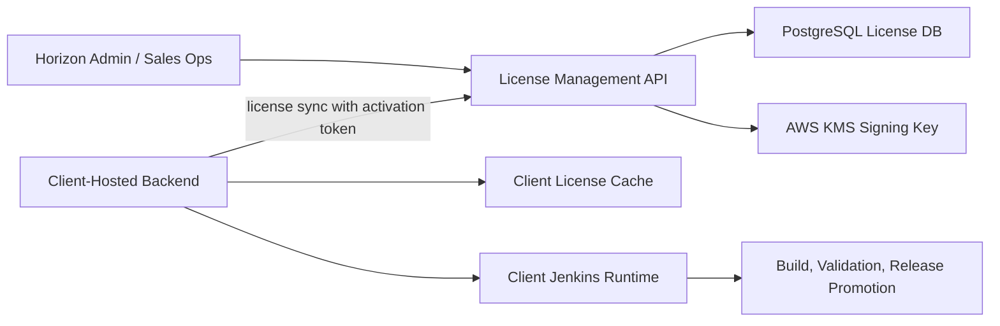

# Phase 1 License Management Service

## Table Of Contents

1. [Introduction](#introduction)
2. [Purpose](#purpose)
3. [Commercial Workflow](#commercial-workflow)
4. [Technical Architecture](#technical-architecture)
5. [Data Model](#data-model)
6. [Trial To Paid Upgrade Flow](#trial-to-paid-upgrade-flow)
7. [Client Installation Values](#client-installation-values)
8. [Security Controls](#security-controls)
9. [How To Run Locally](#how-to-run-locally)
10. [How To Deploy With Helm](#how-to-deploy-with-helm)
11. [Validation Checklist](#validation-checklist)

## Introduction

The Horizon License Management Service is a Horizon-owned backend service that manages client trials, paid subscriptions, activation tokens, license sync, and signed entitlements for client-hosted Horizon Relevance AI DevSecOps installations.

It is separate from the client-hosted backend. Client environments do not own the commercial subscription source of truth. They call Horizon to sync a signed license and then enforce that license locally.

## Purpose

The service lets Horizon Relevance operate a commercial software product without manually embedding trial or enterprise license payloads in client installer files. It supports:

- 14 to 30 day trials.
- Paid and enterprise subscriptions.
- AWS account and installation binding.
- Pipeline and feature entitlements.
- Usage and audit tracking.
- Renewal by subscription update plus client license sync.

## Commercial Workflow

1. Horizon creates a client record.
2. Horizon creates a trial, paid, or enterprise subscription.
3. Horizon creates an activation token.
4. The activation token is delivered to the client through a secure channel.
5. The client stores the activation token in a Kubernetes Secret or external secret manager.
6. The client-hosted backend calls Horizon's license sync endpoint.
7. The service returns a signed license entitlement.
8. The client backend caches the license and enforces it before pipeline execution.
9. Jenkins receives only entitlement metadata from the backend and validates requested pipeline, environment, and feature access before starting work.

## Technical Architecture



## Data Model

| Entity | Purpose |
| --- | --- |
| Client | Stores client key, legal/display name, industry, and status. |
| Plan | Defines reusable commercial bundles such as Trial, Team, Business, or Enterprise. |
| Subscription | Stores active contract dates, license type, allowed AWS accounts, environments, features, and usage limits. |
| ActivationToken | Stores only a hash of the activation token and optional expiry/use limits. |
| Installation | Records each client-hosted installation ID, AWS account, region, product version, and last sync time. |
| License | Stores each signed license payload issued to an installation. |
| UsageEvent | Stores usage counters such as builds, repositories, users, or validation runs. |
| AuditEvent | Stores commercial and license sync audit trail. |

## Trial To Paid Upgrade Flow

When the trial expires or the client signs an enterprise agreement:

1. Horizon updates the client's subscription using the admin API.
2. Horizon changes `license_type` from `trial` to `enterprise` or another paid tier.
3. Horizon extends `expires_at`.
4. Horizon updates allowed environments, pipelines, AWS accounts, and usage limits.
5. The client clicks **Sync License**, or the backend scheduled sync runs automatically.
6. The client receives a new signed entitlement without reinstalling the platform.

The client should not manually edit signed license payloads in `client-values.yaml`. The only client-side values needed are the Horizon license sync endpoint and the activation token secret reference.

## Client Installation Values

For a client-hosted install, the values file should contain only the sync configuration and secret reference:

```yaml
license:
  mode: online-sync
  syncEndpoint: https://license.horizonrelevance.com/api/v1/licenses/sync
  clientId: acme-fintech
  installationId: acme-fintech-us-east-1-eks
  activationTokenSecretName: horizon-license-activation
```

The signed entitlement itself is issued by the Horizon license service and cached by the client backend.

## Security Controls

- Activation tokens are stored as HMAC hashes, not raw tokens.
- License payloads are signed with local HMAC for development or AWS KMS for production.
- Entitlements can bind a license to allowed AWS account IDs and installation IDs.
- Admin APIs require the `X-Horizon-Admin-Key` header.
- Production deployment should place the service behind HTTPS, WAF, rate limits, private admin access, and centralized audit logging.
- Client-hosted Jenkins does not receive raw activation tokens or signing secrets.

## How To Run Locally

```bash
cd secure_SDLC_Platform/license-management-service
python3 -m venv .venv
source .venv/bin/activate
pip install -r requirements.txt
export HORIZON_LICENSE_DATABASE_URL='sqlite:///./license-management.db'
export HORIZON_LICENSE_ADMIN_API_KEY='dev-admin-key'
export HORIZON_LICENSE_SIGNING_SECRET='dev-signing-secret'
export HORIZON_LICENSE_TOKEN_PEPPER='dev-token-pepper'
uvicorn app.main:app --host 0.0.0.0 --port 8090
```

## How To Deploy With Helm

```bash
helm upgrade --install horizon-license-management-service \
  secure_SDLC_Platform/helm/license-management-service \
  -n horizon-license \
  --create-namespace \
  --set secrets.databaseUrl='postgresql+psycopg://horizon_license:<password>@<postgres-host>:5432/horizon_license' \
  --set secrets.adminApiKey='<admin-api-key>' \
  --set secrets.signingSecret='<dev-or-breakglass-signing-secret>' \
  --set secrets.tokenPepper='<token-hash-pepper>'
```

For production KMS signing:

```bash
helm upgrade --install horizon-license-management-service \
  secure_SDLC_Platform/helm/license-management-service \
  -n horizon-license \
  --set config.signingMode=aws-kms \
  --set config.kmsKeyId='arn:aws:kms:us-east-1:<account-id>:key/<key-id>' \
  --set serviceAccount.annotations."eks\\.amazonaws\\.com/role-arn"='arn:aws:iam::<account-id>:role/HorizonLicenseServiceRole'
```

## Validation Checklist

| Check | Expected Result |
| --- | --- |
| `GET /health` | Returns `{"status":"ok"}`. |
| Create plan | Admin API stores a reusable commercial plan. |
| Create client | Admin API stores client identity and status. |
| Create subscription | Subscription has correct expiry, allowed AWS accounts, environments, and features. |
| Create activation token | Raw token is returned once and only hash is stored. |
| Sync license | Client backend receives signed entitlement. |
| Wrong AWS account sync | Request is denied when account is outside `allowed_aws_account_ids`. |
| Expired subscription sync | Request is denied after `expires_at`. |
| Paid upgrade | Admin patches subscription and next sync returns updated entitlement. |
