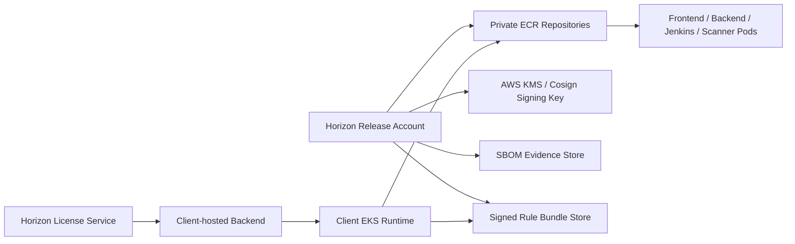

# Phase 11: Secure Product Distribution

## Table of Contents

1. Purpose
2. Target Architecture
3. Horizon Release Workflow
4. Client Install Workflow
5. Signed Images
6. SBOM Evidence
7. Private ECR Governance
8. Signed Rule Bundles
9. Verification Commands
10. Operational Controls

## Purpose

Phase 11 protects Horizon Relevance product intellectual property while still allowing a client to run the platform inside their own AWS account. The goal is not to pretend container images cannot be inspected after a client can pull them. The real control model is:

- keep images in Horizon-owned private ECR;
- grant pull access only to licensed client principals;
- bind license entitlement to client account, installation, environment, and enabled services;
- sign product images and publish SBOM evidence;
- keep Jenkins rules, policy packs, and pipeline templates private or deliver them as signed bundles.

## Target Architecture



## Horizon Release Workflow

1. Build product images in Horizon CI.
2. Push images to Horizon private ECR.
3. Generate SBOMs for each required image.
4. Sign each required image with Cosign and a Horizon-controlled signing key.
5. Package Jenkins rules/templates into a signed rule bundle.
6. Verify image signatures and rule bundle signatures.
7. Grant client ECR pull access only after the client has an active trial or paid entitlement.
8. Publish the allowed image tags, rule bundle version, and public verification key to the client onboarding package.

## Client Install Workflow

1. Client receives an activation token from Horizon.
2. Client runs the installer in their AWS account.
3. Installer deploys the platform using Horizon private ECR images.
4. Client backend syncs license from Horizon license service.
5. Client backend verifies license signature using Horizon public key set.
6. Jenkins validates the signed rule bundle before executing protected rules/templates.
7. Developers use the product normally; they do not receive source code or AWS internals.

## Signed Images

Use `sign-product-images.sh` after images are pushed to Horizon private ECR:

```bash
bash secure_SDLC_Platform/scripts/sign-product-images.sh \
  --key awskms://arn:aws:kms:us-east-1:<horizon-account-id>:key/<key-id> \
  --yes
```

Verify signatures before a release is handed to clients:

```bash
bash secure_SDLC_Platform/scripts/verify-product-signatures.sh \
  --key awskms://arn:aws:kms:us-east-1:<horizon-account-id>:key/<key-id>
```

For production, clients should deploy images by digest whenever possible. Tags are useful for release selection, but digests provide immutability.

## SBOM Evidence

Generate SBOMs for all product images:

```bash
bash secure_SDLC_Platform/scripts/generate-product-sbom.sh
```

The script writes evidence under:

```text
secure_SDLC_Platform/.generated/sbom/
```

Preferred format is SPDX JSON using Syft. If Syft is unavailable, Trivy CycloneDX JSON is used.

## Private ECR Governance

Render a per-client ECR pull policy:

```bash
bash secure_SDLC_Platform/scripts/render-ecr-pull-policy.sh \
  --principal-arn arn:aws:iam::<client-account-id>:role/<client-ecr-pull-role> \
  --repository horizon/backend \
  --expires-at 2026-06-30T23:59:59Z \
  --output /tmp/horizon-backend-ecr-policy.json
```

Attach the rendered policy to the Horizon-owned ECR repository. Repeat per repository or automate it in Horizon release operations.

Recommended controls:

- one pull principal per client;
- expiration aligned with license entitlement;
- deny-by-default repository access;
- CloudTrail monitoring for image pulls;
- immediate policy removal when a license is suspended or revoked.

## Signed Rule Bundles

Jenkins shared library logic and security rules are the highest IP-risk area. For enterprise readiness, do not broadly expose the full rule repository. Package protected rules/templates into a signed bundle:

```bash
bash secure_SDLC_Platform/scripts/package-rule-bundle.sh \
  --source /path/to/private/rules \
  --version 2026.05.23 \
  --signing-key awskms://arn:aws:kms:us-east-1:<horizon-account-id>:key/<key-id> \
  --yes
```

Verify before installing into client Jenkins:

```bash
bash secure_SDLC_Platform/scripts/verify-rule-bundle.sh \
  --bundle secure_SDLC_Platform/.generated/rule-bundles/horizon-rules-2026.05.23.tar.gz \
  --manifest secure_SDLC_Platform/.generated/rule-bundles/horizon-rules-2026.05.23.manifest.json \
  --key awskms://arn:aws:kms:us-east-1:<horizon-account-id>:key/<key-id>
```

## Verification Commands

```bash
bash secure_SDLC_Platform/scripts/verify-product-images.sh

bash secure_SDLC_Platform/scripts/verify-product-images.sh --online

bash secure_SDLC_Platform/scripts/generate-product-sbom.sh --help

bash secure_SDLC_Platform/scripts/sign-product-images.sh --help

bash secure_SDLC_Platform/scripts/package-rule-bundle.sh --help
```

## Operational Controls

For each client trial or paid subscription, Horizon should record:

- client account IDs allowed to pull images;
- installation ID;
- enabled products and pipelines;
- allowed image release version;
- allowed rule bundle version;
- entitlement expiry date;
- ECR policy IDs or repository policy change history;
- license sync and activation audit events.

This makes the platform commercially controllable without requiring Horizon to host or access the client source code.
