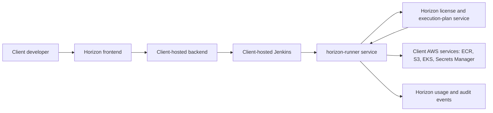

# Thin Client Runner Architecture

## Purpose

The Horizon Thin Runner lets clients run Horizon pipelines inside their own AWS account without giving the client direct access to Horizon's private Jenkins shared-library source code or rule implementation details.

## Conceptual Flow



## Runtime Sequence

1. Developer submits a pipeline request from the client-hosted UI.
2. Backend validates the license, user role, and Environment Catalog target.
3. Backend creates or updates a generic Jenkins wrapper job.
4. Jenkins calls `horizon-runner` with the pipeline kind, job metadata, and request parameters.
5. Runner asks Horizon's execution-plan service for a short-lived signed plan.
6. Horizon validates client entitlement, account binding, installation binding, usage limits, and enabled features.
7. Runner verifies the returned plan with Horizon's public key.
8. Runner executes only allowed plan actions.
9. Runner emits audit and usage events.

## Why This Is Safer Than Shared Library Distribution

| Concern | Shared library model | Thin runner model |
| --- | --- | --- |
| Client needs Horizon GitHub access | Yes | No |
| Client can inspect full pipeline logic | Yes, if repo access is granted | No, only signed execution responses are visible |
| License enforcement location | Backend/Jenkins only | Backend, runner, and Horizon execution service |
| Revocation | Remove repo/ECR/license access | Suspend license and stop plan issuance |
| Regulated client fit | Medium | Stronger |

## Kubernetes Components

The Helm chart deploys:

- `horizon-backend`
- `horizon-jenkins`
- `horizon-runner`
- `horizon-frontend`
- optional SonarQube, LDAP, and Keycloak components

Backend and Jenkins receive:

```yaml
JENKINS_EXECUTION_MODE=runner
HORIZON_RUNNER_URL=http://horizon-runner:8080
```

Runner receives:

```yaml
HORIZON_CLIENT_ID=<client id>
HORIZON_INSTALLATION_ID=<installation id>
HORIZON_ACTIVATION_TOKEN=<secret value>
HORIZON_EXECUTION_PLAN_ENDPOINT=https://license.horizonrelevance.com/api/v1/execution/plans
HORIZON_EXECUTION_EVENT_ENDPOINT=https://license.horizonrelevance.com/api/v1/execution/events
HORIZON_PUBLIC_KEY_PATH=/etc/horizon/license/publicKeyPem
```

## Client Responsibilities

- Keep activation tokens in Kubernetes Secrets, AWS Secrets Manager, External Secrets, or another approved secret store.
- Do not commit client secrets or activation tokens to Git.
- Ensure the platform namespace can pull Horizon private ECR images.
- Configure the Environment Catalog and namespace-scoped deploy roles.
- Mount Horizon public verification key into the runner.

## Horizon Responsibilities

- Issue and manage activation tokens.
- Publish signed product images and SBOM evidence.
- Operate the license and execution-plan service.
- Return only signed, short-lived execution plans.
- Revoke execution plan issuance when a subscription expires or is suspended.

## Rollout Notes

During rollout, keep Jenkins in `runner` execution mode. Do not configure client Jenkins with direct access to Horizon's private `jenkins-shared-library` repository. If a client install still requires GitHub access to Horizon pipeline code, that install has drifted back to the deprecated model.
